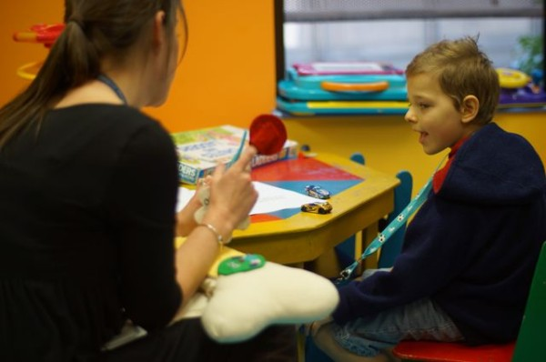

How do you explain leukaemia to a 6 year old? With puppets obviously. The hospital has some excellent Occupational Therapists who are there to help the children understand their illness in a way they can understand. Sam learned that his blood is sick. The factories in his bones make three different types of cells. Red blood cells, White blood cells, and platelets. The problem is that the factories in his bones are making white blood cells that are not quite right and not making enough of the other cells that his body needs. That's where Captain Chemo comes in! His job is to kill the sick cells, but sometimes he gets carried away and accidentally kills some of the healthy cells as well, which can make you feel sick and tired.
