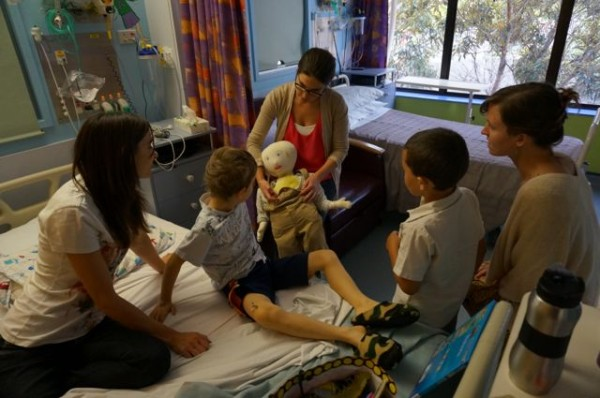

 

On Tuesday morning, Sam had surgery under general anaesthetic, during which the doctors did a few things.

1. took a sample of Sam's bone marrow to send to the U.S.A. to identify which specific variation of pre b cell ALL was in Sam's blood
2. Gave the first dose of chemotherapy into Sam's spinal fluid
3. Installed a port-a-cath.

The Port-a-cath is a round button like thing that is inserted under the skin, and which attaches to a vein. This makes it easy for giving I.V. treatments and taking blood without having to find a vein in the arm. It is still a needle poke through the skin, but it is relatively quick and easy. Sam will have the port-a-cath for the duration of his treatment, and when he is away from the hospital, the skin heals up and he can go swimming and have showers without worrying about it. The only negative is that sometimes they can get infected, in which case it would have to come out.

 Sam was not that happy with his port at first, mostly because it was quite sore from the surgery, however now I think he realises that it does make treatment a bit easier for him. The O.T. came around and showed Sam what the port looks like and how it works on Billy, the local port-a-cath doll.
