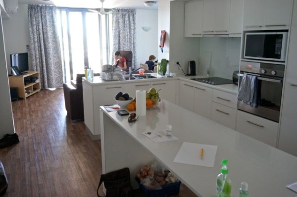

Thanks to the awesomeness of the Leukaemia Foundation, We are now living at the ESA Village, an apartment complex run by the foundation for the purpose of providing emergency accommodation for people forced to live away from their homes while they undergo treatment. What an amazing blessing! The whole complex is only a year old so everything is nice and new. We have a two bedroom unit with all the amenities, even free internet! Woohoo!  There's a games room, a gym, and a little playground as well in the complex. You can tell they have tried really hard to make life as good as it can be in the situation.

The unit even comes with trains right outside. While this is a downside to most normal people, when you are 6, living beside a train track is like winning the lottery. Sam sat out on the balcony for the first two hours just watching the trains. And there are a lot of trains to watch. We have passenger and coal trains here for our listening and viewing pleasure! TO be honest, it doesn't bother us really, after 10 years of living on the pacific highway, we are used to it.

So, though it is still not home, at least we have some space that's our own, and lots of supportive people that work here. Thanks, Leukaemia Foundation! You rock.
