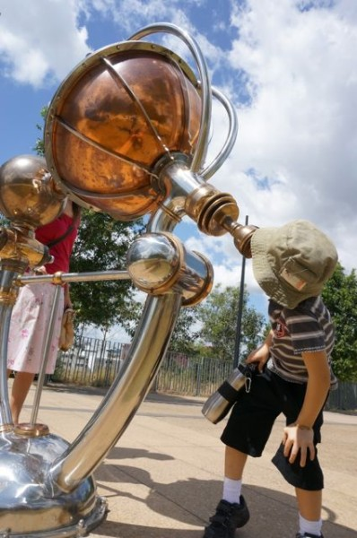
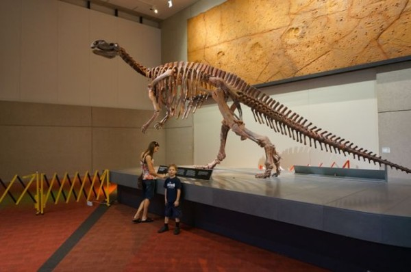

On Sunday I was watching people coming into the carpark by us and they all seemed to be walking in the same direction. "Maybe there is a church near us," Rin said, so I put on my shoes and started following someone to see where I would end up. Turned out there was a neat little market right around the corner from us here, so we decided to all go have a look.

Now, I am not sure if I have mentioned this yet, but due to the steroid Sam is taking, his appetite has probably doubled, and his tastes have changed. So, while we were at the markets, Rin offered him some really yummy strawberry ice-cream, but Sam replied that he would rather have the haloumi and sun dried tomato bread that he had spotted as we walked in to the market. Is this the same boy who has ALWAYS responded "ice-cream" when asked what his favourite food is? Now, when asked the same question, the answer is "curry".

It was good to go to the market, but it was very apparent the lack of energy in Sam. Pretty much, all he could do, was walk the block to the market, look around for about 5 minutes, and then sit down and eat yummy bread. I could see how it would actually be handy to have a pram or something up here, though Sam was not impressed with that idea.

Going out is a bit of a weird thing now, knowing that Sam's immunity is low, I am constantly aware of who is standing near us, what Sam is touching with his hands, making sure those hands don't go near his mouth, and consistently using hand sanitizer to kill any nasties.

Yesterday we went to the museum as a treat after going in for treatment Tuesday. We went first thing in the morning so as to avoid the crowds. Wrong! I guess that was everyone's idea, so we had a rather quick museum experience, trying to steer clear of large clumps of kids, and yet still see all the things Sam wanted to. There is an outdoor dinosaur display, so that was a good spot to hang out for a bit. After the museum, we went down to the river, and had a little snack. Sam was tired by then, so we came home and he spent the rest of the afternoon reading and writing in his journal.
