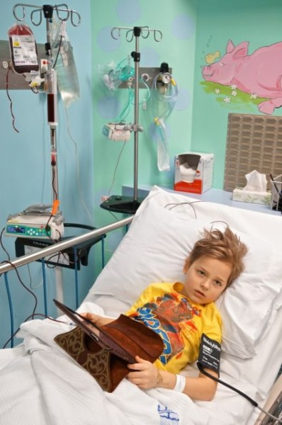
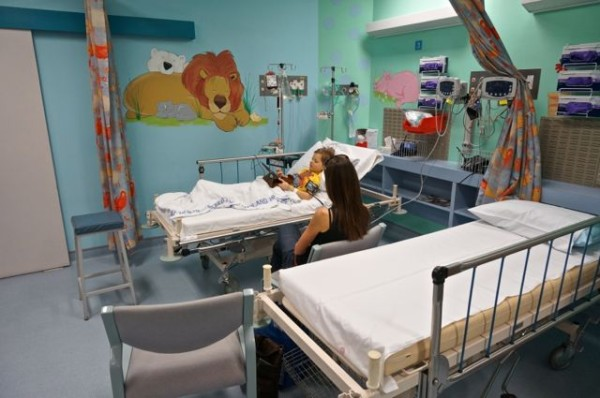

Yesterday we went in to the hospital for Sam's chemo treatment. He was pretty worried about the nurses accessing his port, more about them pulling the needle out rather than it going in. Anyways, to make the day a more positive experience for him, we decided that after getting the chemo, we would go to the museum for a bit and look at the dinosaurs.

Anyways, when they did his bloods yesterday, it turned out that his red blood cells were low, and needed a transfusion, which, sadly meant the museum dinosaurs would miss out on Sam for another day. I guess getting the right blood for a transfusion isn't as easy as going into the cupboard, pulling out a bag of O negative blood and hooking it up. There are some specific things they need to look at to match it to Sam, and then order it from the blood bank. Then it gets hooked up to the I.V. and takes a couple of hours to go into Sam, just so that it isn't a shock to his body. It was amazing to watch though, probably after about an hour we could see the colour coming into Sams face, and his lips started to get nice and pink again. So good](http://www.lookeeneea.com/wp-content/uploads/2013/09/DSC01522.jpg)

I was talking to the nurse about blood products and the blood bank, and she was saying how sometimes it can get tricky getting blood at certain times, how they are sometimes almost literally waiting for it to get donated so they can give it. I am so thankful for the person I will never meet, who took the time to go in and donate the blood Sam got yesterday, and everyone who has donated. Lorinda and I decided it is something we are going to start doing again, it is a way to give such an amazing gift, and it doesn't even cost you anything. Yay blood!! Give it away!

Oh yes, Sam just reminded me as I read this post to him, that it ended up not hurting when they pulled the needle out, so it turned out not to be the worst day of the week after all.
