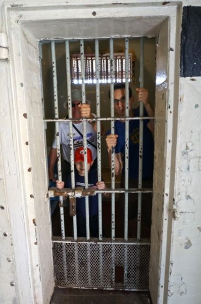

Down the street from where we're staying is an old gaol.  Sam has been curious about it since we arrived and now that Grandma and Grandpa have arrived we  went for the long-awaited tour.  It was really interesting, but although advertised as "child-friendly" it turned out to be rather graphic in parts.  So that, combined with one of the side effects of dexamethasone, led to some trouble sleeping last night.  After listening to music, reading a book, drinking milk and more music he was eventually asleep around midnight.  And then awake for a toilet run.  And then awake again by 5:30.  Fortunately Sam has discovered the world of reading and will happily sit in bed reading his Zac Power book until 6am before getting up for his first breakfast.

I think we'll be pushing for the afternoon nap today.

