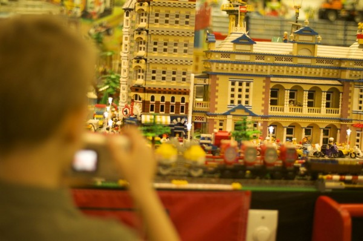
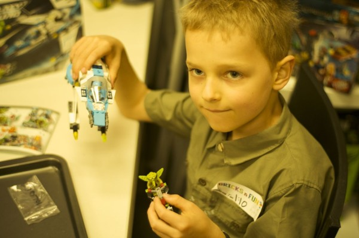

_(by Rin)_

We’ve been travelling up to the Children’s Hospital in Brisbane a lot lately.  Four trips in three weeks to be precise.  Back in October, when we first started going to Brisbane for chemo it felt like a bit of an adventure.  It was rather exciting to be going up to the big city for the day.  Now it has lost a lot of its enticement and it just feels long to drive the two hours to RCH.

Being in the Oncology outpatients clinic is an experience.  The staff are absolutely incredible and constantly maintain a positive attitude.  However, it doesn’t mask the reality that the room is full of children with cancer.  The first time I was in the outpatients, back in September, I was completely overwhelmed.  Everywhere I looked all I could see were sick kids: children connected up to IVs, children with feeding tubes, children with limbs missing, children in varying states of baldness….and all I could think was that all these children have _cancer._ At the time, when Sam’s diagnosis was so new, I couldn’t put him in the same category as the other children.  Surely he didn’t belong with the cancer patients!  Then one of the children rang the bell hanging on the wall of the clinic.  His dad took a photo and everyone clapped.  I blinked back the tears as I realised that this little boy had completely finished his treatment.  Here we were, right at the beginning, with the future stretching out like a huge abyss, full of so much unknown, and I was witnessing someone who had made it to the other side.  It was almost too much to comprehend yet gave me hope at the same time.

Now we’re pros at the whole procedure.  The nurses greet Sam by name as he walks in and we come prepared for the day with the iPad, books, pencil case, and snacks.  Sometimes everything goes along without a hitch, and other times Sam is feeling more sensitive and afraid.  The last time we travelled up,  Sam didn’t want to go to Brisbane.  He didn’t want them to access his port.  He didn’t want to have chemo.  He wished he never had leukaemia.  We all had a little cry in the car together…and then the moment passed and he was okay again.  I am so thankful Sam is at an age where he can understand that he has to do uncomfortable things like take medication, get pricked with needles and have chemo.  He doesn’t like having them done, but has become very resilient.

Recently, to make going to Brisbane more fun, we decided to visit a lego shop while we were up there.  This wasn’t just an ordinary lego shop – in addition to selling lego, you could also book a time to build a lego set and look at their huge lego village display.  Sam loved it!  He could spend days in a place like that.  I don’t know if it made going to the hospital any better, but it was great that Sam got to experience something other than treatment.

