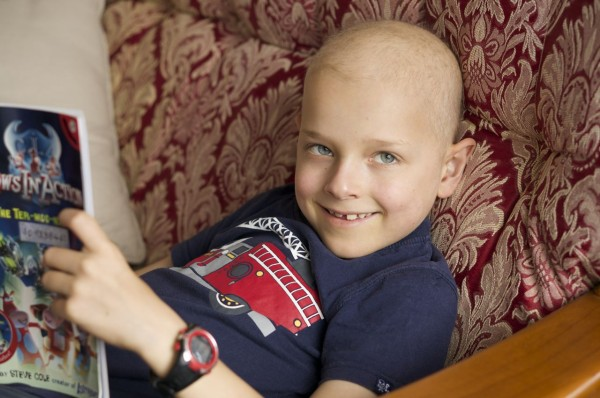

_(by Rin)_

Sam is losing his hair – not all his hair, but a good portion of it, so now he looks somewhat bald.  There are so many conflicting thoughts and emotions I have with the hair loss.  Sam thinks its hilarious – he laughed as he pulled out his hair in clumps, singing a made up song about his hair falling out.  I watched him and laughed too – and felt like crying at the same time.  Hair loss is such a visual reminder of cancer.  For most of this time, Sam has kept his hair and usually looked like a healthy boy.  Now his cancer is so much more obvious.  And yet…not completely.  He still has his eyebrows, eyelashes and a thin covering of hair.

In a weird way, however, I like it – partly because he now legitimately looks the part, and I somewhat like looking at his bald head.  I think it looks cool and interesting. We stayed home from church and school this week because his immunity is quite low, and I was rather disappointed.  In a wacky way I wanted to show off my bald-headed boy!

