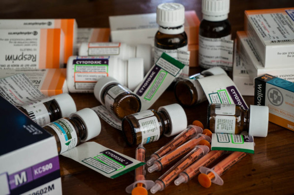

The other day, we came home from the hospital loaded with an assortment of drugs in a big brown paper bag. And the reason for this? We won't be going back to the hospital in Brisbane for a full three months! That's right, Sam has now entered the maintenance phase of his chemotherapy treatment, and this follows a standard protocol, so basically, we are actually going to have a set schedule and be able to plan things in advance! So, for the next 2.5 years, this is what Sam's Chemo will look like:

Every 3 months- I.V. Methotrexate Chemo at Brisbane Hospital

Every 3 months- One week of oral Dexamethesone Steroid

Every 2 weeks-Blood test

Once a week- Methotrexate Chemo Tablets

3 days a week, morning and evening- Bactrim Antibiotics tablets

Daily- Mercaptopurine chemo tablets.

The reason for this long term chemo treatment is that they have found that the leukaemia cells tend to hide out in different places in the body, the testicles and the spinal fluid being two major areas. They have found that this low dosage, long term therapy has been most effective at making sure all the leukaemia cells are wiped out. So Sam's neutrophil count will be monitored through his blood tests, and that count will be indicative of how the chemo will be affecting any residual cancer cells, and then his dosage will be adjusted to try and get the optimum balance. Apparently they are aiming for a neutrophil count of between 1 and 2. A count of below one is where your body can't fight infection as well, and above 2, the chemo is probably not affecting the cancer cells like it should.

So, anyways, all that to say that we are stoked that we have made it this far, and that Sam is really healthy for what he has been through. And now back to "real" life. Whatever that is……….

\*\*I wrote this post probably a month ago, and never got around to posting it. so here it is. Better late than never.\*\*
