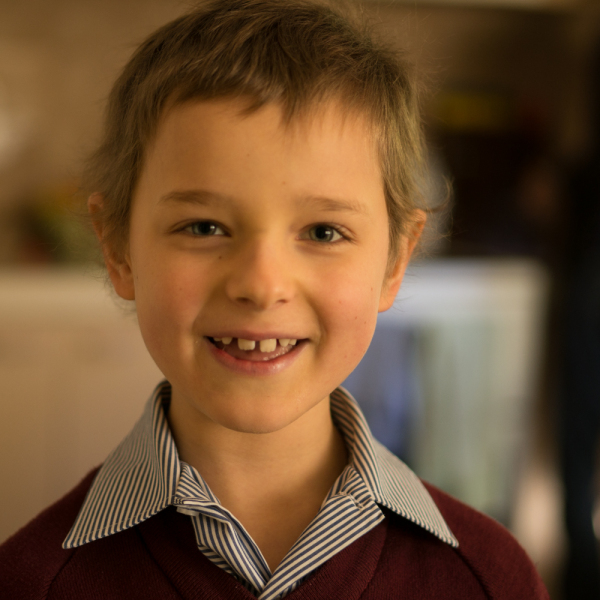

This time last year we were up in Brisbane with Sam undergoing his first chemo treatments for leukaemia. It was such a time of unknown – we didn’t know how long we’d be on this journey, what the outcome would be, or how Sam’s body would react to the chemo. We were immersed into a whole new hospital world with a crash course in medical language and procedures.

Now here we are, one year later. We thought it was appropriate to celebrate, or at least commemorate the occasion. Sam was really excited about the idea of celebrating a year of leukaemia treatment. He thought it would be great to go up to Brisbane and not go to the hospital! We weren’t up for the drive so we had a special meal and family dance party instead. That seemed just as good.

One year later we now speak the language fluently. Words like mercaptopurine, dexamethasone, methotrexate and neutrophils are commonplace in our house. We bring our own swabs to the blood tests and have our own collection of hospital spew bags, gloves and masks at home.

One year later we are still navigating Sam’s wacky tastebuds. I’m still getting used to having a picky eater after having a boy who would eat almost anything with gusto for the first six and a half years of his life.

One year later we are living in the rhythm of treatment: Stop eating at 3pm, take tablets at 5pm, have dinner at 6pm. Chris has set alarms so that we’ll remember to give Sam his Bactrim twice a day on Mon, Tues and Wed and his methotrexate with dinner on Thursday. Every fortnight, on a Wednesday morning, we go for a blood test, sometimes to the local pathology clinic and sometimes to Tweed hospital. Trips to Brisbane are now a rarity at once every three months.

With the rhythm, we can’t forget that Sam is on treatment but sometimes I can forget that his body is being slammed with crazy chemicals. And then something happens to remind me…his energy suddenly plummets or a blood test shows he has low neutrophils and I am reminded once again of the delicate balance we are walking.

And one year later I am thankful, so thankful for Sam’s life. I am thankful for the medical system. I am thankful that we live in a country where his treatment is covered by medicare. I am thankful that we live within driving distance of a major hospital. I am thankful that Sam’s hair has grown back. I am thankful that he is able to run and play without pain. I am thankful that his body is staying healthy. I am thankful for new friends we have met along the way with stories of their own, and old friends who have walked with us through this journey.  And I am so thankful for my God who has sustained us and carried us through this past year.
