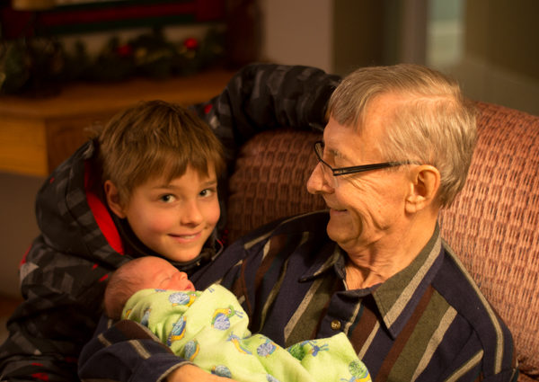

A lot has happened since the last post over a year and a half ago.  Sam is still on treatment, but he's now experiencing the cancer care system in Canada.  We moved to Manitoba last July and it's been a big year to say the least.  We were shocked and grieved to discover Chris's dad had blood cancer, so early in 2015 we began to make plans to move back to Canada.  At the same time we were pursing IVF to have a long desired second child.  So, in the past year we have sold most of our belongings, moved from Australia to Canada, bought and furnished a home, transferred Sam's leukaemia treatment, started Sam in a new school and had a beautiful baby girl named Isobel. Chris has spent much time with his parents, helping at their house and doing the things his dad, Alf, is no longer able to do.  We do not know how long Alf will be with us and value the time that we have.

The transition from Australia to Canada was seamless as far as Sam's treatment. Many countries have the same protocol and fortunately Australia and Canada are the same.  We were very impressed with how quickly they got us into the system here.  The paediatric cancer care facility is excellent and very kid-friendly with toys, video games and activities.

Sam's health has been stable, with only one emergency room visit since we got here.  He was sick pretty much all winter though - I think he caught every cold virus going around and then ended up with the flu, probably due in part from his suppressed immune system and just being exposed to a whole heap of Canadian germs that his body hadn't experienced before.  Thankfully spring has arrived and he hasn't had a cough in at least a month!

We also had an interesting development with Sam's port-a-cath where they access his vein to take blood and give chemotherapy.  The skin covering it started to thin and slowly his body began to push it right out!  We knew it wasn't looking good and then one night as Sam got ready for bed he noticed the port was actually exposed.  So it was off to the hospital for emergency surgery the next day.  They removed the port which means that now all bloodwork is done through his arm and chemo is done through a regular IV.  He was pretty upset about this at first as he was really comfortable with everything being done through the port, but now that it's out he was saying that he actually likes it better.  This is partly because now he only has a scar on his chest rather than a strange looking bump.  A port defined him as having cancer but a scar could be from anything.  He no longer feels he needs to wear his rashie when swimming indoors.

A few little differences in the medication has taken some getting used to.  Some of the tablets here are bigger or a different shape so they're a little trickier to swallow.  One medication only comes in 2.5mg tablets rather than 10mg so Sam is having to take twelve at a time rather than three!  The last time he had to take those he thought he'd see how many he could swallow in one go. He got up to four - what a champion!

We are now counting down the months until the end of treatment.  November 2016 - hard to believe it's only six months away.  It's been a long road and a third of Sam's life.  Sam is particularly looking forward to not taking medication anymore.  He almost can't remember what it was like before he had to take his chemo everyday.  We had imagined celebrating this milestone with our Aussie friends.  It's been difficult moving partway through treatment - our friends who walked with us through the turbulent early part of the journey are now far away.  We are thankful however to be with family, making new friends and re-establishing old ones who can be part of our lives here and look forward to celebrating with them in six months time.
