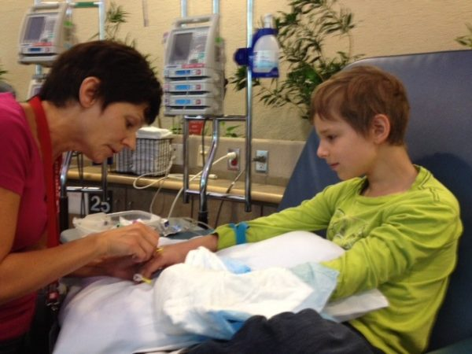
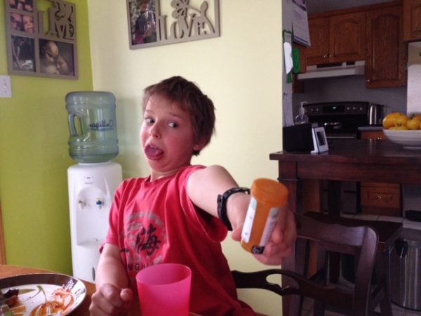

The end of treatment is starting to feel real! Sam is beginning to experience some "last times." This past week he had his final IV vincristine chemo and today was the final dexamethasone dose - 6 1/2 tablets down the hatch! Next month will be the last lumbar puncture and then we'll count down his final three oral medications. Woo hoo!  One of the things Sam is most looking forward to is not having to take his daily mercaptopurine tablets, which require him to stop eating for two hours before taking the drug and one hour after. He particularly didn't appreciate that during Christmas last year with all the tasty treats around!
