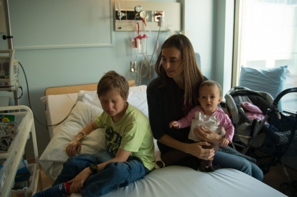
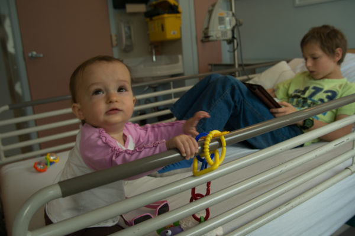
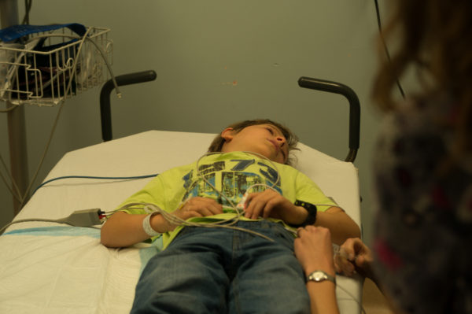
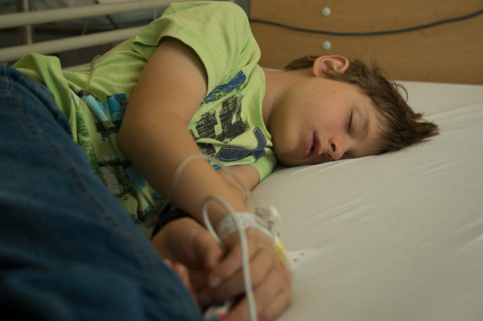
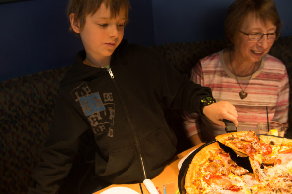
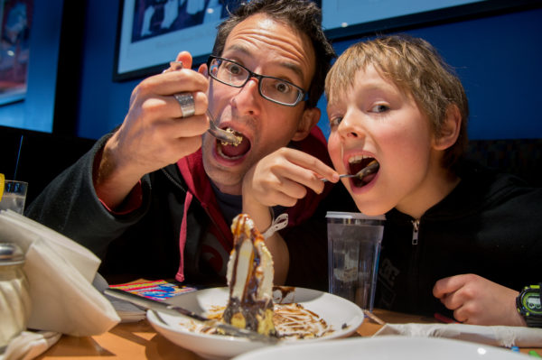
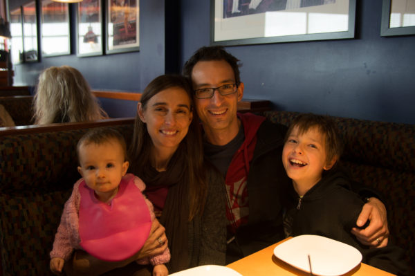

We just passed Thanksgiving weekend here in Canada.  I am so thankful for many things: that we can celebrate here with family, for our beautiful little girl, that we have made it through over a year being supported by Chris's business, for our new community of friends we are developing here…and of course that Sam is coming closer and closer to the end of over three years of chemotherapy.

Last week he had his final lumbar puncture, which marks the end of chemo injections and the end of being admitted to hospital for his treatments!  The rest is done through CancerCare where he has his blood tests and doctor appointments, and he will maintain oral chemotherapy for another month yet.

LPs start off with Sam getting hooked up to an IV, which is the part he really doesn't like.  Of all the pokes he has to get, somehow that one in his hand is the worst for him.  Here's how he feels about it:

After he's ready to go there's a bit of time to relax before they take him in.  This is Sam's favourite part because he gets to play on the iPad!  

In the treatment room they inject him with anaesthetic so he's asleep for the procedure, then they roll him onto his side to extract some spinal fluid and inject the chemo.  Here in Canada they allow a parent to be in the room for the whole procedure, which is different than in Australia.  There we'd have to leave once he was asleep.  It's been both interesting and difficult to watch.  I find it so hard to see them putting such awful stuff into my son's spine and Chris finds medical procedures rather nauseating - he's nearly passed out once or twice.

Afterward Sam has a little nap as the anaesthetic wears off.  The nurses always seem to want to wake him earlier than he'd like.  If it were up to him he'd sleep there for hours!

We had a celebratory meal at Boston Pizza thanks to Grandma! It felt really good to celebrate the last of all Sam's lumbar punctures - he's had 21 in all.  What a brave and awesome kid!
